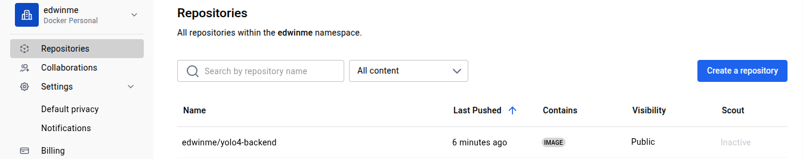

# YOLO Application Deployment on GKE

## Overview
This project demonstrates the containerization and Kubernetes deployment of a full-stack YOLO (You Only Look Once) object detection application. The application is deployed on Google Kubernetes Engine (GKE) and consists of:

- **Frontend**: React-based user interface
- **Backend**: Node.js/Express API server
- **Database**: MongoDB for data persistence

## How to run the app
GKE services will genererate an external IP after using K8 services provided in the Google Cloud, this IP is shared with my TM.
